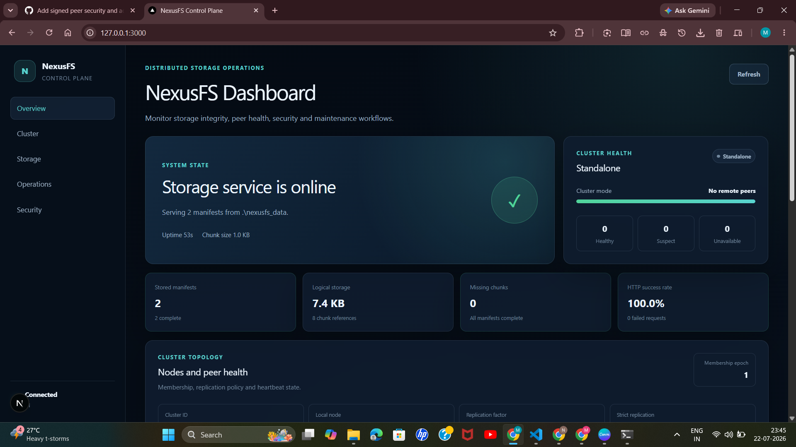
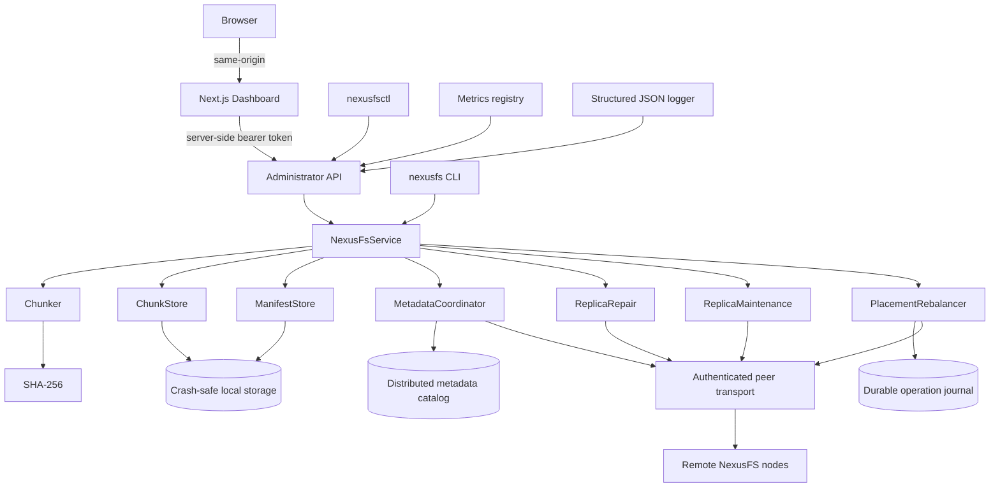

# NexusFS

[](https://github.com/Mahek576/nexusfs/actions/workflows/ci.yml)
[](https://github.com/Mahek576/nexusfs/actions/workflows/dashboard-ci.yml)

NexusFS is a C++20 distributed content-addressed storage system built from first principles. It combines deterministic chunk storage, crash-safe persistence, authenticated peer communication, replication and repair, distributed metadata coordination, dynamic membership, epoch-fenced rebalancing, observability, an administrator CLI, and a production-built Next.js operations dashboard.

The project is designed as a serious systems-engineering portfolio project rather than a thin CRUD application. Its core workflows exercise operating-system concepts, networking, concurrency, file-system design, distributed systems, security, testing, and production-style operational tooling.

> **Project status:** feature-complete portfolio release candidate. NexusFS is suitable for local demonstrations and engineering evaluation, but it is not presented as a production replacement for a mature distributed file system.

---

## Product Demo



The dashboard is connected to the real C++ daemon through authenticated server-side requests. It exposes storage health, file manifests, cluster state, security posture, maintenance controls, and rebalancing operations without sending the administrator token to the browser.

Additional screenshots:

- [Stored-file catalog and cluster topology](docs/images/dashboard-catalog.png)
- [Administrator operations and security posture](docs/images/dashboard-operations-security.png)

---

## What NexusFS Implements

### Content-addressed storage

- Binary-safe fixed-size chunking
- SHA-256 chunk identities
- Automatic deduplication
- Canonical binary manifests
- Content-addressed manifest identities
- Deterministic sharded storage paths
- Byte-perfect reconstruction
- Missing and corrupted chunk detection
- Deep integrity verification

### Durability and recovery

- Temporary-file write protocol
- Atomic finalization
- Read-back verification
- Crash-safe durable file helpers
- Startup recovery of interrupted writes
- Cleanup of stale temporary artifacts
- Recovery-aware chunk and manifest stores

### Distributed storage

- Persistent cluster identity and membership state
- Authenticated peer HTTP transport
- Chunk replication
- Strict replication mode
- Automatic replication after file storage
- Heartbeat scheduling and peer health tracking
- Peer-backed missing-chunk recovery
- Proactive replica maintenance
- Background repair scheduling
- Deterministic metadata ownership
- Manifest publication and recovery
- Distributed metadata catalog exchange
- Metadata catalog synchronization
- Dynamic cluster membership
- Epoch-fenced, idempotent placement rebalancing
- Durable operation journal

### Security and administration

- HMAC-signed peer requests
- Timestamp validation
- Nonce and replay protection
- Constant-time administrator token checks
- Authenticated administrator API
- `nexusfsctl` operations CLI
- Security metrics and audit-oriented structured logs

### Operations and observability

- Boost.Beast HTTP server
- Health and metrics endpoints
- JSON structured logging
- Runtime request, security, cluster, repair, and rebalancing metrics
- Dashboard-ready administrator overview
- Next.js 16 operations dashboard
- One-command local product startup
- Separate C++ and dashboard CI workflows

---

## Architecture



The system is split into three main planes:

1. **Data plane** — chunk storage, manifests, reconstruction, verification, replication, and repair.
2. **Control plane** — membership, metadata ownership, catalog synchronization, maintenance, and rebalancing.
3. **Operations plane** — administrator API, `nexusfsctl`, metrics, structured logs, security, and dashboard.

A deeper design walkthrough is available in [docs/ARCHITECTURE.md](docs/ARCHITECTURE.md).

---

## One-Command Local Startup

### Prerequisites

- Windows PowerShell
- CMake 3.20 or newer
- A C++20 compiler
- vcpkg
- Node.js 24 and npm
- A successful Debug build of NexusFS

From the repository root:

```powershell
.\scripts\start-local.ps1
```

The launcher:

- validates ports `8080` and `3000`
- creates `dashboard/.env.local` with a cryptographically random local administrator token when needed
- opens a NexusFS daemon window
- opens a Next.js dashboard window
- uses the same administrator token for both processes

Open:

```text
http://127.0.0.1:3000
```

See [docs/LOCAL_DEVELOPMENT.md](docs/LOCAL_DEVELOPMENT.md) for individual launchers and troubleshooting.

---

## Build on Windows

The following commands assume `VCPKG_ROOT` points to a valid vcpkg installation.

```powershell
cmake `
    -S . `
    -B build `
    -A x64 `
    -DBUILD_TESTING=ON `
    "-DCMAKE_TOOLCHAIN_FILE=$env:VCPKG_ROOT/scripts/buildsystems/vcpkg.cmake"
```

Build:

```powershell
cmake --build build --config Debug --parallel
```

Run the complete C++ regression suite:

```powershell
ctest `
    --test-dir build `
    -C Debug `
    --output-on-failure
```

Validate the dashboard:

```powershell
Push-Location .\dashboard

try
{
    npm ci
    npm run lint
    npm run typecheck
    npm run build
}
finally
{
    Pop-Location
}
```

---

## Build on Linux

```bash
cmake \
  -S . \
  -B build \
  -DCMAKE_BUILD_TYPE=Debug \
  -DBUILD_TESTING=ON \
  -DCMAKE_TOOLCHAIN_FILE="$VCPKG_ROOT/scripts/buildsystems/vcpkg.cmake"

cmake --build build --parallel
ctest --test-dir build --output-on-failure
```

The dashboard can be validated with:

```bash
cd dashboard
npm ci
npm run lint
npm run typecheck
npm run build
```

The supplied one-command product launcher is currently PowerShell-focused.

---

## Executables

### `nexusfs`

The storage CLI supports the local content-addressed data path:

```powershell
.\build\Debug\nexusfs.exe store .\sample.txt
.\build\Debug\nexusfs.exe list
.\build\Debug\nexusfs.exe inspect <manifest-id>
.\build\Debug\nexusfs.exe verify <manifest-id>
.\build\Debug\nexusfs.exe restore <manifest-id> .\reconstructed\sample.txt
```

### `nexusfsd`

Runs the storage daemon, HTTP server, background heartbeat scheduler, replica maintenance scheduler, administrator API, metrics, and structured logging.

```powershell
.\build\Debug\nexusfsd.exe `
    --address 127.0.0.1 `
    --port 8080 `
    --storage-root .\nexusfs_data `
    --chunk-size 1024
```

### `nexusfsctl`

The authenticated administrator CLI supports:

```powershell
.\build\Debug\nexusfsctl.exe status
.\build\Debug\nexusfsctl.exe files
.\build\Debug\nexusfsctl.exe sync
.\build\Debug\nexusfsctl.exe repair
.\build\Debug\nexusfsctl.exe maintenance
.\build\Debug\nexusfsctl.exe rebalance <operation-id> <membership-epoch>
```

Provide the administrator token through `NEXUSFS_ADMIN_TOKEN` or `--token`.

---

## Storage Pipeline

### Store

```text
Source file
    ↓
Binary chunking
    ↓
SHA-256 per chunk
    ↓
Content-addressed chunk paths
    ↓
Deduplication
    ↓
Canonical manifest
    ↓
Durable local commit
    ↓
Metadata publication
    ↓
Strict or best-effort replica placement
```

### Restore

```text
Manifest ID
    ↓
Load and verify canonical manifest
    ↓
Resolve ordered chunk references
    ↓
Load and hash each local chunk
    ↓
Attempt peer-backed recovery when required
    ↓
Write temporary reconstructed file
    ↓
Validate byte and chunk counts
    ↓
Atomically publish final output
```

---

## On-Disk Layout

```text
nexusfs_data/
├── chunks/
│   └── <first-two-hash-characters>/
│       └── <remaining-hash-characters>
├── manifests/
│   └── <first-two-hash-characters>/
│       └── <remaining-hash-characters>
└── cluster/
    ├── membership and node state
    ├── metadata state
    └── operation journal
```

Runtime data is intentionally excluded from Git.

---

## Consistency and Recovery Model

NexusFS uses deterministic identities and durable local state to make operations repeatable:

- chunks and manifests are immutable by content identity
- repeated stores reuse existing chunks
- manifest encoding is canonical
- repair operations verify content before accepting recovered chunks
- membership epochs fence stale topology changes
- rebalancing operations use durable operation IDs for idempotency
- startup recovery scans and repairs interrupted local persistence workflows
- background maintenance detects under-replicated content and attempts repair

NexusFS currently implements deterministic coordination around an explicit membership view. It does **not** claim to implement a general distributed consensus protocol.

---

## Security Model

Peer requests are protected through signed request metadata, timestamps, nonces, and replay rejection. Administrator endpoints require a bearer token checked using constant-time comparison.

The dashboard uses Next.js server components and server actions:

```text
Browser
    ↓ same-origin request
Next.js server
    ↓ Authorization: Bearer <server-side token>
NexusFS administrator API
```

The browser does not receive `NEXUSFS_ADMIN_TOKEN`.

### Deployment boundary

TLS is intentionally deferred in the current release. Run the administrator API on loopback for local demonstrations, or place it behind a trusted TLS-terminating reverse proxy before exposing it beyond a controlled environment.

---

## Dashboard

The operations dashboard displays:

- daemon connection and uptime
- storage manifests and logical bytes
- missing chunks and completeness
- HTTP success rate
- standalone or distributed cluster state
- membership epoch and replication policy
- peer health and failures
- stored-file catalog
- administrator sync, repair, maintenance, and rebalance controls
- peer request signing
- administrator authentication
- replay and rejection counters

Peer-dependent controls are disabled automatically in standalone mode. Local repair and maintenance remain available.

---

## Testing

The CTest suite covers the complete system across focused executables, including:

- hashing, manifests, chunking, deduplication, reconstruction, and verification
- storage service behavior and concurrency
- CLI parsing and daemon configuration
- HTTP routing, uploads, lifecycle, metrics, and structured logging
- crash-safe durable files and startup recovery
- cluster-node persistence
- authenticated peer transport
- automatic strict replication
- heartbeats and cluster observability
- peer-backed repair and proactive maintenance
- background maintenance scheduling
- metadata ownership, transport, publication, recovery, catalog exchange, and synchronization
- dynamic membership
- consistency and rebalancing
- security and administrator control-plane workflows

Focused stress validations repeatedly execute distributed and recovery suites before each feature milestone is committed.

---

## Continuous Integration

### C++ workflow

`.github/workflows/ci.yml` validates the C++ system on Windows and Ubuntu using CMake, vcpkg, and CTest.

### Dashboard workflow

`.github/workflows/dashboard-ci.yml` validates:

```text
npm ci
    ↓
ESLint
    ↓
TypeScript type checking
    ↓
Next.js production build
```

Both workflows run for relevant pull requests targeting `main`.

---

## Repository Structure

```text
nexusfs/
├── .github/workflows/
│   ├── ci.yml
│   └── dashboard-ci.yml
├── dashboard/                 # Next.js administrator control plane
├── docs/
│   ├── ARCHITECTURE.md
│   ├── LOCAL_DEVELOPMENT.md
│   ├── PROJECT_STATUS.md
│   └── images/
├── include/nexusfs/
│   ├── admin/
│   ├── app/
│   ├── cli/
│   ├── cluster/
│   ├── daemon/
│   ├── http/
│   ├── observability/
│   ├── security/
│   └── storage/
├── scripts/
│   ├── run-daemon.ps1
│   ├── run-dashboard.ps1
│   └── start-local.ps1
├── src/
│   ├── admin/
│   ├── app/
│   ├── cli/
│   ├── cluster/
│   ├── daemon/
│   ├── http/
│   ├── observability/
│   ├── security/
│   └── storage/
├── tests/
├── CMakeLists.txt
├── vcpkg-configuration.json
└── vcpkg.json
```

---

## Design Guarantees

The current implementation is designed to provide:

- deterministic chunk and manifest identities
- binary-safe storage and reconstruction
- deduplication across repeated content
- integrity verification before accepting data
- durable local state transitions
- recovery after interrupted persistence workflows
- authenticated peer and administrator requests
- replay-resistant peer communication
- repeatable metadata ownership
- epoch fencing for stale membership views
- idempotent rebalancing operations
- automatic replica repair attempts
- observable operational state
- cross-platform automated validation

---

## Current Limitations

NexusFS is a portfolio-scale distributed systems implementation. The current release does not yet provide:

- TLS termination inside `nexusfsd`
- a consensus protocol such as Raft
- quorum-based read/write semantics
- multi-datacenter replication
- erasure coding
- garbage collection and reference reclamation
- storage quotas
- at-rest encryption
- role-based administrator authorization
- rolling-upgrade compatibility guarantees
- production-scale performance validation

These limitations are explicit so that the project does not overstate its production readiness.

---

## Roadmap

### Completed

- [x] Local content-addressed engine
- [x] Crash-safe durability and startup recovery
- [x] HTTP daemon and application API
- [x] Structured logging and metrics
- [x] Persistent cluster-node foundation
- [x] Authenticated peer transport
- [x] Chunk replication and automatic strict replication
- [x] Heartbeats and failure observation
- [x] Peer-backed replica repair
- [x] Proactive and scheduled replica maintenance
- [x] Deterministic distributed metadata ownership
- [x] Manifest and metadata catalog exchange
- [x] Metadata publication, recovery, and synchronization
- [x] Dynamic cluster membership
- [x] Epoch-fenced idempotent rebalancing
- [x] Signed peer security and administrator control plane
- [x] Next.js operations dashboard
- [x] One-command local product startup
- [x] C++ and dashboard CI

### Optional future extensions

- [ ] TLS or mTLS
- [ ] Raft-backed membership and metadata consensus
- [ ] Quorum reads and writes
- [ ] Garbage collection and reference accounting
- [ ] Storage quotas and admission control
- [ ] At-rest encryption
- [ ] Containerized multi-node demonstration
- [ ] Load, soak, and fault-injection benchmarks

---

## Project Status

```text
Content-addressed storage:           complete
Crash-safe local durability:         complete
HTTP daemon and REST control plane:  complete
Peer transport and replication:      complete
Replica repair and maintenance:      complete
Distributed metadata coordination:   complete
Dynamic membership:                  complete
Consistency-aware rebalancing:       complete
Security and administrator tooling:  complete
Operations dashboard:                complete
Local product packaging:             complete
Automated validation:                complete

Production hardening:                intentionally out of scope
```

NexusFS is now a complete, demonstrable systems-engineering product with an explicit boundary between implemented guarantees and future production-hardening work.
