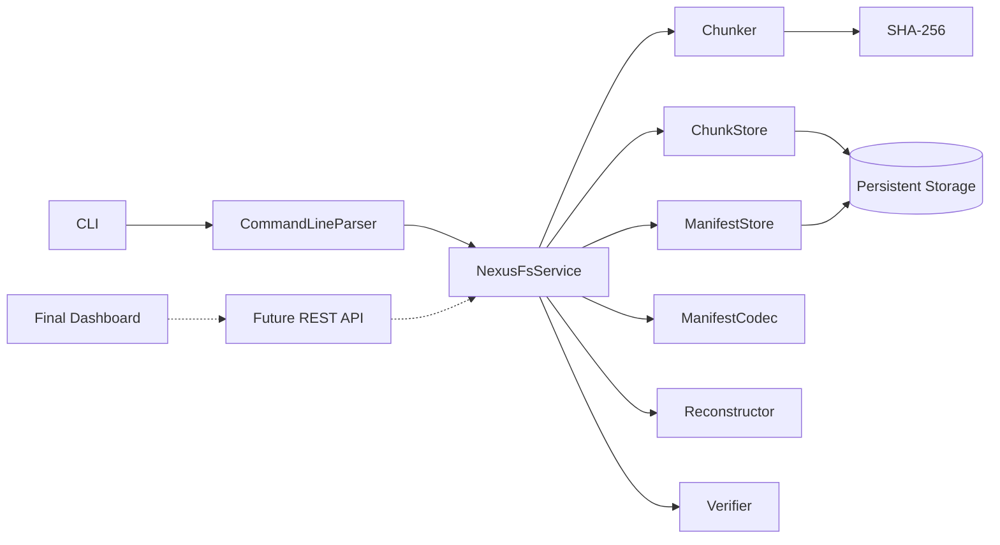

# NexusFS

[](https://github.com/Mahek576/nexusfs/actions/workflows/ci.yml)

NexusFS is a C++20 content-addressed storage engine built from first principles as the foundation for a future distributed file-storage system.

The current local V1 can split files into binary chunks, identify each chunk using SHA-256, deduplicate repeated content, persist chunks and manifests, reconstruct files without the original source, detect missing or corrupted data, and expose these workflows through both a command-line interface and a reusable application service.

> NexusFS local V1 is complete as a single-node storage foundation. Networking, replication, distributed metadata, APIs, and the final dashboard are planned future layers.

---

## Features

- Binary-safe fixed-size file chunking
- SHA-256 content identity
- Content-addressed chunk storage
- Automatic chunk deduplication
- Persistent canonical binary manifests
- Content-addressed manifest identities
- Temporary-write-and-rename finalization
- Read-back integrity verification
- Byte-perfect file reconstruction
- Missing-chunk detection
- Corrupted-chunk detection
- Persistent manifest catalog
- Reusable application service layer
- Automated storage, CLI, and service tests
- Cross-platform CI on Windows and Ubuntu

---

## Architecture



The command-line interface is intentionally thin. It parses commands, calls `NexusFsService`, and formats the returned result.

Core storage workflows are independent of terminal output, allowing the same service layer to support a future REST API and dashboard backend.

---

## Storage Pipeline

### Store

```text
Source file
    ↓
Binary chunking
    ↓
SHA-256 per chunk
    ↓
Content-addressed chunk paths
    ↓
Chunk deduplication
    ↓
Canonical file manifest
    ↓
SHA-256 manifest ID
    ↓
Persistent manifest storage
```

### Restore

```text
Manifest ID
    ↓
Load and verify manifest
    ↓
Decode ordered chunk references
    ↓
Load and verify each chunk
    ↓
Write temporary reconstructed file
    ↓
Validate byte and chunk counts
    ↓
Rename to final output
```

The original source file is not required during restoration.

---

## Content-Addressed Storage Layout

NexusFS stores runtime data under `nexusfs_data/`:

```text
nexusfs_data/
├── chunks/
│   ├── 58/
│   │   └── f1e32d...
│   └── 0e/
│       └── 28d1db...
└── manifests/
    ├── e5/
    │   └── 5fa96f...
    └── 55/
        └── e7f73b...
```

For a 64-character SHA-256 identifier:

```text
58f1e32d9b47...
```

NexusFS uses:

```text
Shard directory: first 2 characters
Filename:        remaining 62 characters
```

Result:

```text
chunks/58/f1e32d9b47...
```

The same sharding strategy is used for manifests.

---

## Manifest Format

A file manifest stores the metadata required to reconstruct a file:

- Format version
- Original filename
- Original file size
- Configured chunk size
- Ordered chunk hashes

All integer fields are encoded in big-endian byte order.

```text
+--------------------------+------------------+
| Field                    | Encoded size     |
+--------------------------+------------------+
| Magic: "NEXUSFSM"        | 8 bytes          |
| Format version           | 4 bytes          |
| Original file size       | 8 bytes          |
| Configured chunk size    | 8 bytes          |
| Filename length          | 8 bytes          |
| Filename                 | Variable         |
| Chunk count              | 8 bytes          |
| Ordered SHA-256 hashes   | 64 bytes each    |
+--------------------------+------------------+
```

The manifest ID is:

```text
SHA-256(canonical encoded manifest)
```

Identical file metadata and ordered chunk references therefore produce the same manifest ID.

---

## CLI Commands

The executable currently supports five commands.

### Store a file

```powershell
.\build\Debug\nexusfs.exe store .\sample.txt
```

Example result:

```text
Command: store
Original filename: sample.txt
Original file size: 7592 bytes
Total chunks: 8
New chunks stored: 8
Manifest ID: <64-character SHA-256 ID>
File stored successfully.
```

Running the same command again reuses existing chunks and the existing manifest.

---

### Restore a file

```powershell
.\build\Debug\nexusfs.exe restore <manifest-id> .\output\sample.txt
```

NexusFS refuses to overwrite an existing output path.

---

### Inspect a manifest

```powershell
.\build\Debug\nexusfs.exe inspect <manifest-id>
```

`inspect` displays:

- Original filename
- File size
- Chunk size
- Ordered chunk references
- Present and missing chunks
- Overall storage completeness

Inspection checks whether referenced chunk files are present. It does not hash every chunk.

---

### Verify stored content

```powershell
.\build\Debug\nexusfs.exe verify <manifest-id>
```

`verify` performs deep integrity checking:

- Loads the manifest
- Validates the manifest SHA-256 identity
- Confirms canonical encoding
- Loads every referenced chunk
- Recalculates each chunk SHA-256
- Checks positional chunk sizes
- Confirms the total file size

---

### List stored files

```powershell
.\build\Debug\nexusfs.exe list
```

The catalog is derived directly from canonical files in the manifest store, avoiding a separate mutable database index.

---

## Build Requirements

- CMake 3.20 or newer
- A C++20 compiler
- vcpkg
- OpenSSL, installed automatically through the vcpkg manifest
- Git

The repository contains:

```text
vcpkg.json
vcpkg-configuration.json
```

CMake uses vcpkg manifest mode to install the required dependencies.

---

## Build on Windows

The following commands assume `VCPKG_ROOT` points to a valid vcpkg installation.

```powershell
cmake `
    -S . `
    -B build `
    -A x64 `
    -DBUILD_TESTING=ON `
    "-DCMAKE_TOOLCHAIN_FILE=$env:VCPKG_ROOT/scripts/buildsystems/vcpkg.cmake"
```

Build:

```powershell
cmake --build build --config Debug --parallel
```

Run all tests:

```powershell
ctest --test-dir build -C Debug --output-on-failure
```

Run NexusFS:

```powershell
.\build\Debug\nexusfs.exe list
```

---

## Build on Linux

The following commands assume `VCPKG_ROOT` points to a valid vcpkg installation.

```bash
cmake \
  -S . \
  -B build \
  -DCMAKE_BUILD_TYPE=Debug \
  -DBUILD_TESTING=ON \
  -DCMAKE_TOOLCHAIN_FILE="$VCPKG_ROOT/scripts/buildsystems/vcpkg.cmake"
```

Build:

```bash
cmake --build build --parallel
```

Run all tests:

```bash
ctest --test-dir build --output-on-failure
```

Run NexusFS:

```bash
./build/nexusfs list
```

---

## Automated Tests

NexusFS currently has three CTest executables.

### `nexusfs_tests`

Covers:

- SHA-256 known-answer vectors
- Manifest encoding and decoding
- Deterministic manifest identities
- Malformed manifest rejection
- Empty files
- Files smaller than one chunk
- Exact chunk-boundary files
- Multi-chunk binary files
- Intra-file deduplication
- Persistent chunk and manifest read-back
- Byte-perfect reconstruction
- Corrupted-chunk detection

### `nexusfs_cli_tests`

Covers:

- Valid parsing for all five commands
- Missing command rejection
- Unknown command rejection
- Invalid manifest-ID rejection
- Uppercase manifest-ID rejection
- Incorrect argument-count rejection

### `nexusfs_service_tests`

Covers the reusable application boundary:

- Service constructor validation
- File storage
- Chunk and manifest deduplication
- Inspection
- Verification
- Catalog listing
- Restoration without the source file
- Byte-perfect recovery
- Output overwrite protection

Run all suites:

```powershell
ctest --test-dir build -C Debug --output-on-failure
```

---

## Continuous Integration

GitHub Actions runs NexusFS on every push and pull request targeting `main`.

The CI matrix includes:

```text
Ubuntu + GCC
Windows + MSVC
```

Each environment performs:

```text
Clean checkout
    ↓
vcpkg setup
    ↓
CMake configuration
    ↓
Core and executable build
    ↓
Storage tests
    ↓
CLI tests
    ↓
Service tests
```

Workflow definition:

```text
.github/workflows/ci.yml
```

---

## Repository Structure

```text
nexusfs/
├── .github/
│   └── workflows/
│       └── ci.yml
├── include/
│   └── nexusfs/
│       ├── app/
│       │   └── nexusfs_service.hpp
│       ├── cli/
│       │   └── command_line.hpp
│       └── storage/
│           ├── chunker.hpp
│           ├── chunk_store.hpp
│           ├── file_manifest.hpp
│           ├── file_manifest_codec.hpp
│           ├── file_reconstructor.hpp
│           ├── file_verifier.hpp
│           ├── manifest_store.hpp
│           └── sha256_hasher.hpp
├── src/
│   ├── app/
│   │   └── nexusfs_service.cpp
│   ├── cli/
│   │   └── command_line.cpp
│   ├── storage/
│   │   ├── chunker.cpp
│   │   ├── chunk_store.cpp
│   │   ├── file_manifest.cpp
│   │   ├── file_manifest_codec.cpp
│   │   ├── file_reconstructor.cpp
│   │   ├── file_verifier.cpp
│   │   ├── manifest_store.cpp
│   │   └── sha256_hasher.cpp
│   └── main.cpp
├── tests/
│   ├── test_cli.cpp
│   ├── test_main.cpp
│   └── test_service.cpp
├── CMakeLists.txt
├── sample.txt
├── vcpkg-configuration.json
└── vcpkg.json
```

---

## Design Guarantees

The current local engine provides:

- Deterministic chunk identities
- Deterministic manifest identities
- Ordered reconstruction
- Binary-safe operation
- Deduplication across identical chunks
- Integrity verification during reads
- Temporary output cleanup after reconstruction failure
- Protection against accidental output overwrite
- Deterministic manifest enumeration
- Cross-platform automated validation

---

## Current Limitations

The current version is intentionally a local single-node foundation.

It does not yet provide:

- Networked storage nodes
- Replication
- Quorum reads or writes
- Distributed metadata consensus
- Garbage collection
- Reference counting
- Concurrent writer coordination
- File locking
- Compression
- Encryption
- Authentication or authorization
- Durable `fsync` guarantees against sudden power loss
- REST or gRPC APIs
- A graphical dashboard

SHA-256 provides content identity and corruption detection. It does not provide encryption or access control.

---

## Roadmap

### Phase 1 — Local Content-Addressed Engine

- [x] Binary chunking
- [x] SHA-256 content identity
- [x] Persistent chunk store
- [x] Deduplication
- [x] Canonical binary manifests
- [x] Persistent manifest store
- [x] File reconstruction
- [x] Inspection and deep verification
- [x] Manifest catalog
- [x] Reusable service layer
- [x] Automated tests
- [x] Windows and Linux CI

### Phase 2 — Local Service and API

- [ ] Storage daemon
- [ ] REST or gRPC interface
- [ ] Structured JSON responses
- [ ] Configurable storage root and chunk size
- [ ] Health and metrics endpoints
- [ ] API integration tests

### Phase 3 — Distributed Storage

- [ ] Peer discovery
- [ ] Chunk transfer protocol
- [ ] Replication policies
- [ ] Node membership
- [ ] Failure detection
- [ ] Distributed metadata
- [ ] Consistency and quorum rules
- [ ] Repair and rebalancing
- [ ] Concurrent access control

### Phase 4 — Reliability and Operations

- [ ] Garbage collection
- [ ] Reference tracking
- [ ] Storage quotas
- [ ] Structured logging
- [ ] Metrics and tracing
- [ ] Authentication
- [ ] Authorization
- [ ] Benchmarking and load testing
- [ ] Crash-recovery testing

### Phase 5 — NexusFS Dashboard

The dashboard is planned as the final product-facing layer after the API and distributed backend are stable.

Planned dashboard capabilities include:

- Node health and availability
- Stored-file catalog
- Manifest and chunk inspection
- Storage usage
- Deduplication statistics
- Replication state
- Missing and corrupted chunk alerts
- Restore operations
- Verification controls
- Cluster topology
- Performance and reliability metrics

---

## Project Status

```text
Local content-addressed storage engine: complete
CLI workflows:                         complete
Automated regression testing:          complete
Cross-platform CI:                     complete
Reusable application service:          complete

REST/API layer:                        planned
Distributed node layer:                planned
Replication and coordination:          planned
Operational tooling:                   planned
Final dashboard:                       planned
```

NexusFS is currently a tested, reusable single-node storage foundation—not yet a complete distributed file system.