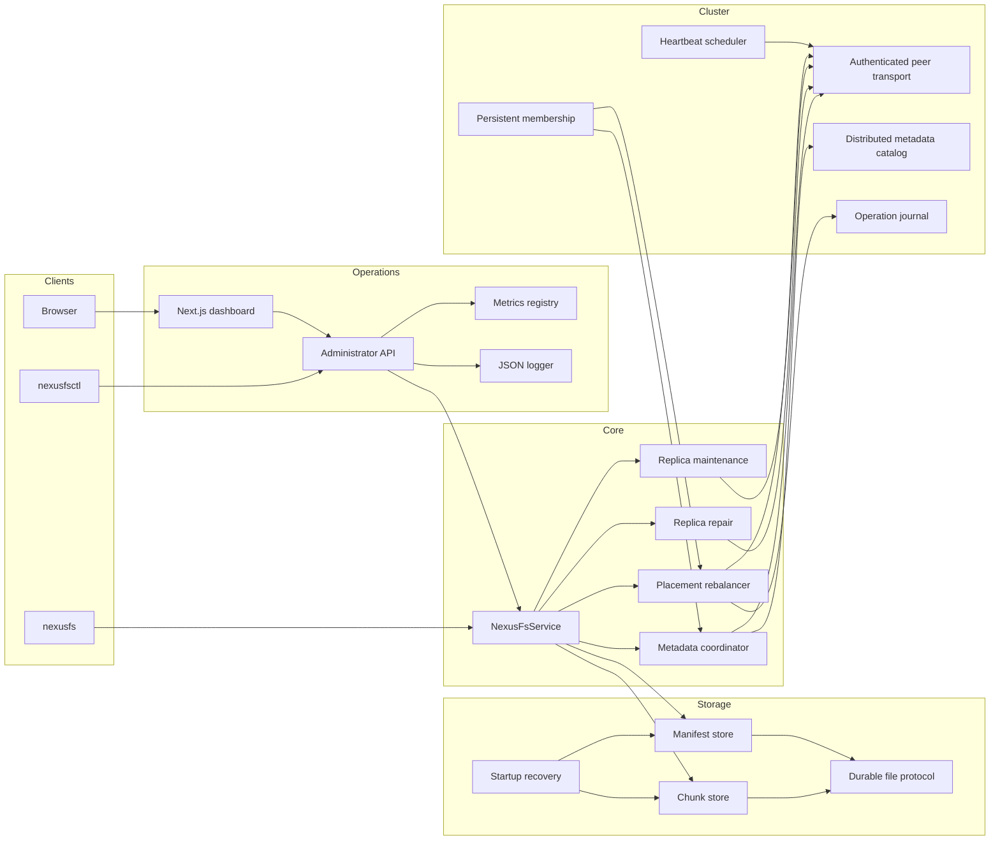
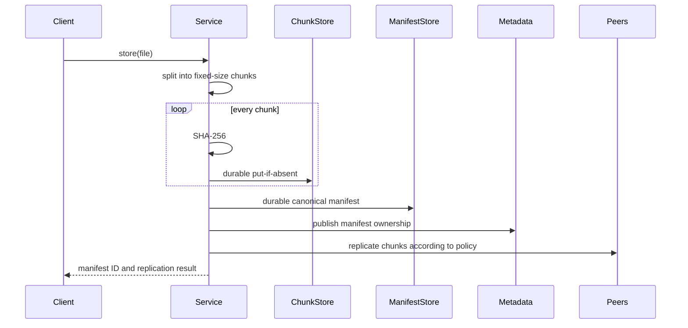
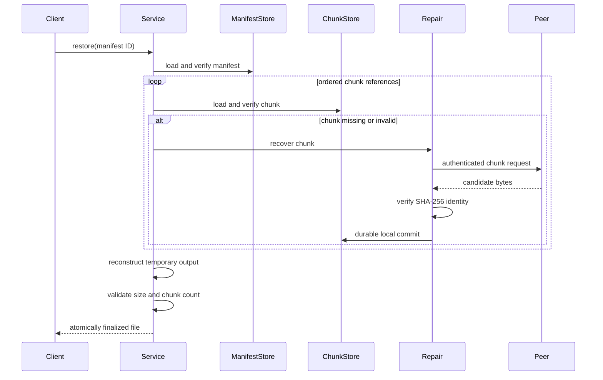

# NexusFS Architecture

## 1. System Overview

NexusFS is organized as a layered distributed storage system:



## 2. Executable Boundaries

### `nexusfs`

A thin local storage CLI. It parses commands and invokes `NexusFsService` for
store, list, inspect, verify, and restore workflows.

### `nexusfsd`

The long-running daemon. It owns:

- the HTTP server
- storage service lifetime
- cluster membership
- peer transport
- heartbeat scheduling
- metadata synchronization
- replica maintenance scheduling
- metrics
- structured logging
- administrator security

### `nexusfsctl`

A command-line client for the authenticated administrator API.

### Next.js dashboard

A server-rendered operations UI. Server components and server actions call the
administrator API using a server-side bearer token. Browser code never receives
that token.

## 3. Data Model

### Chunk identity

```text
chunk_id = SHA-256(chunk_bytes)
```

Chunk files are immutable and stored below a two-character shard directory.

### Manifest identity

```text
manifest_id = SHA-256(canonical_manifest_bytes)
```

A manifest contains:

- format version
- original filename
- original byte size
- configured chunk size
- ordered chunk hashes

The ordering of chunk references is part of the file identity.

## 4. Local Persistence Protocol

NexusFS avoids publishing partially written objects:

```text
write temporary file
    ↓
flush and close
    ↓
read back and verify
    ↓
atomically rename to final content-addressed path
```

Startup recovery scans storage directories for interrupted temporary artifacts
and reconciles them before normal service begins.

## 5. Store Workflow



Strict replication can make the store operation fail when the configured replica
requirement cannot be satisfied.

## 6. Restore and Repair Workflow



## 7. Cluster Membership

Membership state is persisted rather than reconstructed only from command-line
arguments. Each accepted topology change advances a membership epoch.

The epoch is used to:

- reject stale rebalancing requests
- fence outdated placement decisions
- make topology-dependent operations explicit
- preserve a deterministic current membership view

NexusFS does not claim to implement consensus. Membership changes are expected to
be coordinated by the administrator or a future consensus layer.

## 8. Metadata Ownership and Catalogs

Ownership is deterministic for a given manifest and membership view. Owners
publish manifest metadata, and nodes exchange authenticated metadata catalogs.

The synchronizer can:

- detect catalog differences
- retrieve missing manifests
- publish locally known metadata
- recover owner data after failure
- converge repeated exchanges without duplicating immutable objects

## 9. Replica Maintenance

Replica maintenance separates detection from repair:

1. enumerate locally referenced chunks
2. inspect observed remote replicas
3. identify under-replicated content
4. request or create verified replicas
5. update metrics and structured logs

The background scheduler repeats this workflow at a configured interval.

## 10. Rebalancing and Idempotency

Rebalancing accepts:

- an operation ID
- an expected membership epoch

The operation journal records durable progress. Replaying the same operation ID
is safe, while a stale expected epoch is rejected.

```text
request
    ↓
validate operation ID
    ↓
validate membership epoch
    ↓
load or create journal record
    ↓
calculate deterministic placement
    ↓
execute required transfers
    ↓
persist completion
```

## 11. Peer Security

Peer requests include signed request metadata. Validation covers:

- shared cluster secret
- request method and target
- body digest
- timestamp window
- nonce uniqueness
- constant-time signature comparison

Accepted nonces are retained for the replay window so that a captured request
cannot be submitted again successfully.

## 12. Administrator Security

Administrator routes require a bearer token. The token is compared in constant
time.

For the dashboard:

```text
Browser
    ↓
Next.js server action or server component
    ↓ Authorization: Bearer <token from .env.local>
NexusFS administrator API
```

The browser receives rendered data, not the token.

## 13. Observability

NexusFS exposes metrics covering:

- HTTP requests and active connections
- accepted and rejected peer requests
- replay rejection
- accepted and rejected administrator requests
- heartbeat and transport outcomes
- replication and repair runs
- metadata synchronization
- maintenance
- rebalancing and stale-epoch rejection

Structured JSON logs contain event names and contextual fields suitable for
machine parsing.

## 14. Concurrency Model

The system uses explicit service boundaries and synchronized mutable state.
Background schedulers own their worker lifetimes and are stopped during normal
daemon shutdown.

Immutable content identities reduce coordination requirements for chunk and
manifest writes: concurrent attempts to publish the same valid object converge
on the same final path.

## 15. Failure Boundaries

| Failure | Expected behavior |
|---|---|
| Duplicate chunk write | Reuse the existing content-addressed object |
| Interrupted temporary write | Remove or reconcile it during startup recovery |
| Missing local chunk | Attempt verified peer-backed repair |
| Corrupted peer response | Reject it after content-hash verification |
| Replayed peer request | Reject it using the nonce cache |
| Stale rebalance request | Reject it using membership-epoch fencing |
| Repeated rebalance operation | Resume or return the durable idempotent result |
| Unavailable peer | Record health failure and continue according to policy |
| Dashboard disconnected | Render a disconnected state without exposing secrets |

## 16. Explicit Non-Goals of the Current Release

- consensus
- quorum reads and writes
- internal TLS termination
- multi-datacenter replication
- erasure coding
- garbage collection
- at-rest encryption
- production SLO claims

These are future extensions rather than hidden assumptions.
